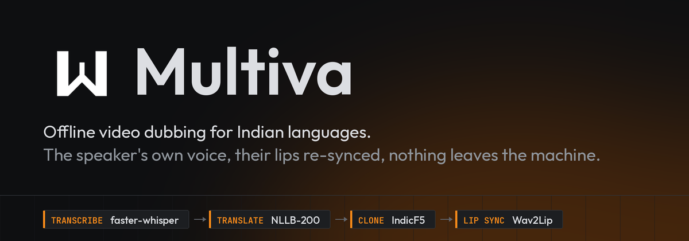
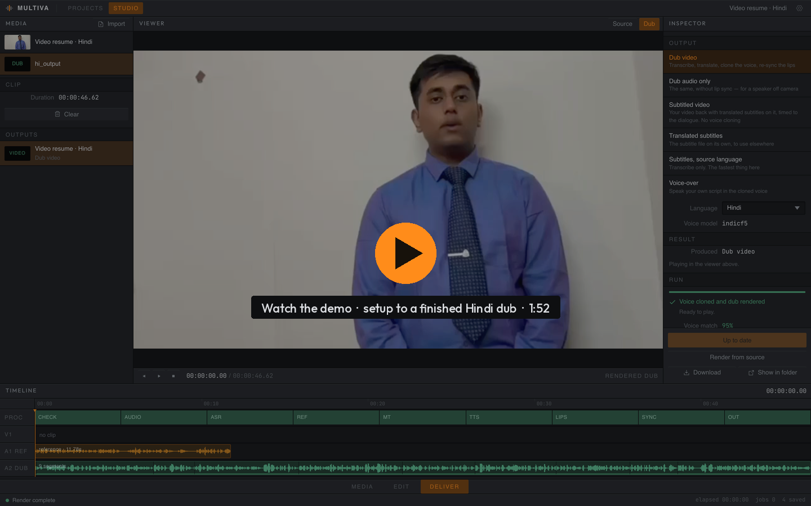
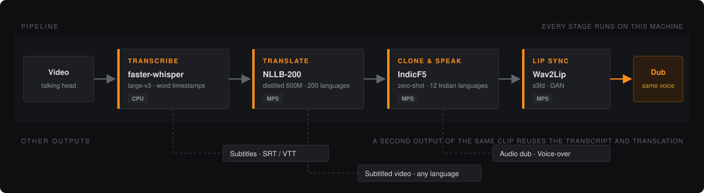
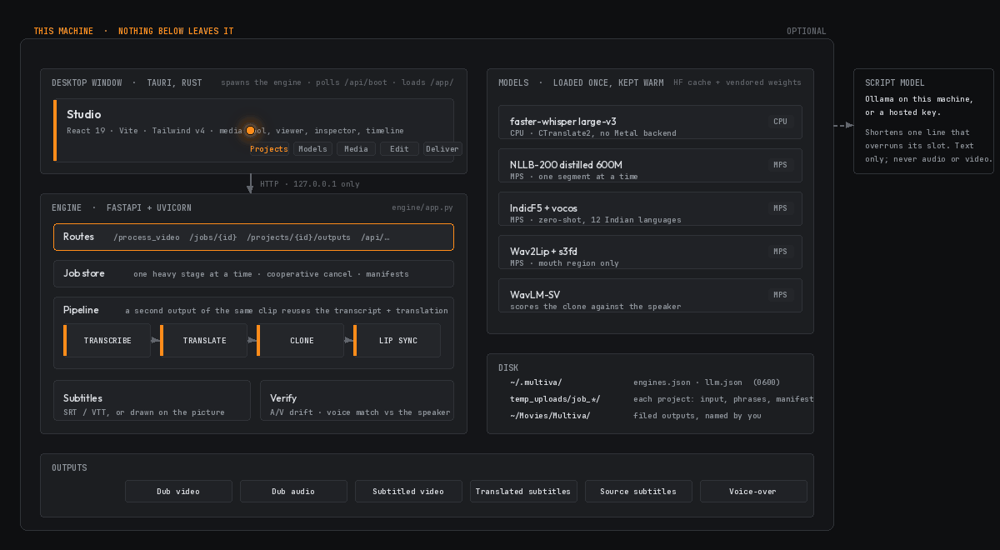
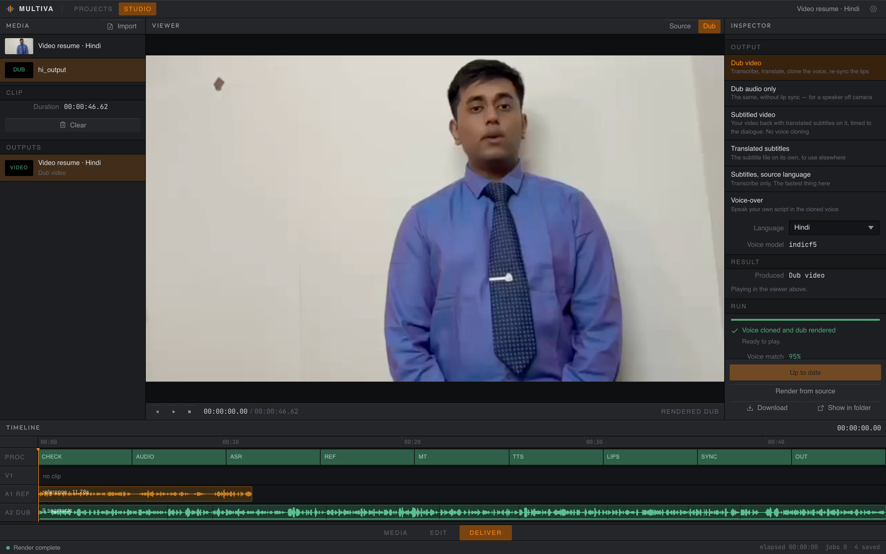
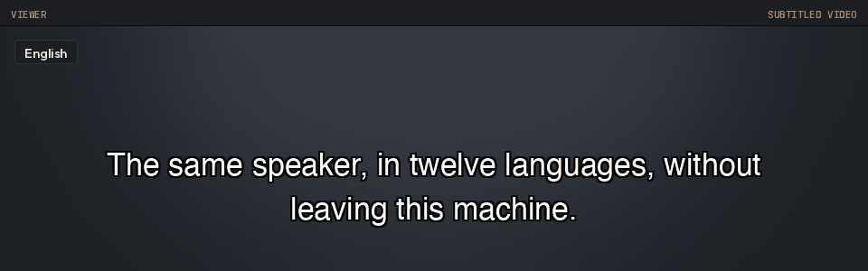
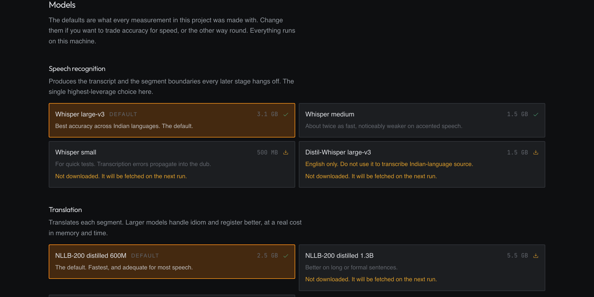

<p align="center">
  
</p>

<p align="center">
  <a href="https://github.com/muditagrawal-alt/Multiva.Ai/actions/workflows/checks.yml"></a>
  
  
  
  
</p>

<p align="center">
  Point it at a talking-head video, pick a language, and get the same person saying the same thing in that language —
  <b>in their own voice, with their mouth matching</b>. Nothing is uploaded: no API key, no per-minute cost, no account.
</p>

---

## Demo

The whole thing, start to finish, on a 46-second clip: choosing the models, starting a project, importing the clip, rendering a Hindi dub, naming the output, and playing the result — voice match 95% on that run, A/V drift 0 ms. Recorded from the real interface, not mocked.

<p align="center">
  <a href="docs/media/demo.mp4">
    
  </a>
  <br>
  <sub>▶ <a href="docs/media/demo.mp4">docs/media/demo.mp4</a> — 1:52, with sound and captions that explain each step. The ten-minute render is shown at 43×; everything else is real time.</sub>
</p>

| | |
|---|---|
| **Languages** | Hindi, Marathi, Bengali, Assamese, Tamil, Telugu, Kannada, Malayalam, Gujarati, Punjabi, Odia, Urdu (IndicF5) · English, Spanish, French, German, Japanese, Chinese, Arabic and 9 more (XTTS, optional) |
| **Runs on** | Apple silicon (MPS), CUDA, or CPU. Developed on an M4 / 24 GB |
| **Speed** | About 10× realtime on an M4: the 46 s demo clip renders in 8 min. An offline batch tool, not a live one |
| **Cloning** | Zero-shot from 6–12 s of the speaker. No training, no fine-tuning |
| **Storage** | Local only. No database, no object store, no telemetry |

---

## How it works

<p align="center">
  
</p>

Four models, in order, each handing the next what it needs and nothing more:

| Stage | Model | Runs on | What it contributes |
|---|---|---|---|
| Transcribe | [faster-whisper](https://github.com/SYSTRAN/faster-whisper) large-v3 | CPU | Words with timestamps, VAD-gated so silence is never "heard" as speech |
| Translate | [NLLB-200](https://huggingface.co/facebook/nllb-200-distilled-600M) distilled 600M | MPS / CUDA | One segment at a time, with code-switching repaired afterwards |
| Clone & speak | [IndicF5](https://huggingface.co/ai4bharat/IndicF5) + vocos | MPS / CUDA | The speaker's voice, from a 6–12 s reference the pipeline picks itself |
| Lip sync | [Wav2Lip](https://github.com/Rudrabha/Wav2Lip) + s3fd | MPS / CUDA | The mouth region only, composited back with a feathered mask |

Whisper stays on the CPU because CTranslate2 has no Metal backend; everything else shares the GPU, one heavy stage at a time. A second output of the same clip — a subtitled video after a dub, say — reuses the transcript and the translation, so it takes seconds rather than minutes.

## System architecture

<p align="center">
  
</p>

Three processes, all on one machine, and one optional call out of it:

| Part | What it is | Talks to |
|---|---|---|
| **Desktop window** — `apps/studio/src-tauri`, Rust | A Tauri shell. Finds the checkout, starts the engine with the project's own Python, shows a splash until `/api/boot` says the models are loaded, then opens the studio. No web server of its own. | the engine, over `127.0.0.1` |
| **Studio** — `apps/studio`, React 19 | The interface: Projects, Models, and the Media / Edit / Deliver pages of a project. Every action is an HTTP call; nothing is computed in the browser. Ships built in `web/`. | the engine |
| **Engine** — `engine/app.py`, FastAPI | The job store and the pipeline. Accepts a clip, runs the stages one heavy step at a time, writes a manifest per project so everything reopens after a restart, and files the finished output where you asked. | the models, the disk |
| **Models** | faster-whisper, NLLB-200, IndicF5 + vocos, Wav2Lip + s3fd, WavLM for scoring. Loaded once on first use and kept warm; swapping one in the Models page takes effect on the next render. | — |
| **Disk** | `~/.multiva/` for settings (mode `0600`), `temp_uploads/job_*/` for each project's input, phrase cache and manifest, and your output folder for filed renders. There is no database. | — |
| **Script model** — optional | Ollama on this machine by default, or a hosted key. Used for exactly one job: shortening a translated line that overruns its slot. Text only, one line at a time, never audio or video. | the engine, on request |

**A render, end to end.** The studio POSTs the clip and the choices to `/process_video/` and polls `/jobs/{id}/status`. The engine probes and trims, extracts 16 kHz audio, transcribes with word timestamps, picks the cleanest 6–12 s window as the voice reference, translates segment by segment, synthesizes each phrase in the cloned voice onto a fixed-length track, re-syncs the mouth, checks A/V drift and voice match, files the result, and writes the manifest. Cancel is cooperative — every stage boundary is a checkpoint — and lands within about one phrase. A second output for the same project skips straight to the stage it actually needs.

---

## What you get

### A studio, not a form

A docked editor: media pool, viewer, inspector, timeline, status bar. The waveforms are decoded from the real audio and the ruler is scrubbable. Every project keeps all of its outputs together — the dub, the subtitled version, the SRT — and reopens with its phrase timeline intact.

<p align="center">
  
</p>

### Six outputs from one clip

| Output | What it is | Needs a voice model |
|---|---|---|
| **Dub video** | Transcribe, translate, clone the voice, re-sync the lips | yes |
| **Dub audio only** | The same, without lip sync — for a speaker off camera | yes |
| **Subtitled video** | Your video back with subtitles drawn on it, timed to the dialogue, in any language | no |
| **Translated subtitles** | The `.srt` / `.vtt` on its own, to use elsewhere | no |
| **Subtitles, source language** | Transcribe only. The fastest thing here | no |
| **Voice-over** | Speak your own script in the cloned voice | yes |

Subtitles are drawn onto the picture with a font that actually holds the script — every Indian language, Arabic and Urdu right-to-left, CJK — and the self test checks each one on the machine it runs on.

<p align="center">
  
</p>

### Edit the result, not the settings

- **Edit any phrase.** Select it on the timeline, change the words, re-speak just that line. One phrase re-synthesizes in seconds; the rest come from a per-phrase cache. Undo restores the previous take byte for byte, because regenerating would give a different one.
- **Re-roll a delivery.** Synthesis is seeded for reproducibility, so a new seed is how you get a different take of the same words.
- **Choose the reference window** the voice is cloned from, instead of accepting the automatic pick.
- **Trim** with in and out points, and lay a **music bed** under the result.
- **Cancel** a render. Cooperative, and it lands within about one phrase.
- **Name and file** every output where you want it; open its folder or download it from the studio.

### Models you can see

Every model is a card with its real size and whether it is on disk. Swap the speech recogniser or the translator and the change applies to the next render — no restart.

<p align="center">
  
</p>

---

## Install

Python 3.10, ffmpeg, and Rust. Multiva is a desktop application: the studio is a native window, and Rust builds it once. The interface files ship built, so Node is only needed to change them.

```bash
# macOS:  brew install python@3.10 ffmpeg
# Ubuntu: sudo apt install python3.10 python3.10-venv ffmpeg fonts-noto-core
# Rust, any platform:  curl --proto '=https' --tlsv1.2 -sSf https://sh.rustup.rs | sh

git clone https://github.com/muditagrawal-alt/Multiva.Ai
cd Multiva.Ai
./run.sh
```

That is the whole install. On a fresh clone `run.sh` offers to build the Python environment, fetch the models (about 7.5 GB, resumable, every file checked against a SHA-256) and build the window, asking once for each. It starts Ollama if it is installed, and opens the studio when the engine is ready.

To do the steps by hand instead:

```bash
python3.10 -m venv venv
./venv/bin/pip install -r requirements.txt
./venv/bin/python scripts/download_models.py      # --check reports without downloading
cd apps/studio && npx tauri build                 # the window, once
```

## Run

```bash
./run.sh                    # local script model through Ollama
./run.sh --provider groq    # a hosted script model instead
./run.sh --fresh            # as a brand-new user, without touching your setup
```

Everything runs on this machine. There is no browser mode and no hosted version: the engine listens on `127.0.0.1` only, and the only thing that can ever leave the machine is one line of translated text, if you choose a hosted script model.

## Test

```bash
./venv/bin/python scripts/selftest.py path/to/clip.mp4     # ~20 min, a real dub
./venv/bin/python scripts/selftest.py --quick              # a minute, nothing rendered
```

157 checks against the running engine: a real dub, the phrase editor, re-rolling a take, a different reference window, a re-render, a subtitled video in a chosen language, a second output rendered from a reopened project, every export, a voice-over, a cancellation that actually stops, and a font for every script. Anything needing a model you have not configured is skipped rather than failed. Voice match on the fixture clip is reported every run, because a green suite with a worse-sounding dub would still be a regression.

---

## Script intelligence (optional)

One LLM call, for one job: rewriting a line **shorter so it fits its slot**. When a translation runs longer than the speaker's original phrasing, the only other option is time-stretching, and stretching is what makes a dub sound robotic.

It defaults to Ollama on your own machine, and the studio's Script model panel offers whatever you have pulled. You can instead point it at Groq, Claude, Gemini, OpenAI, Grok, or any OpenAI-compatible endpoint, in which case **one line of already-translated text** leaves the machine per rewrite — never video, audio, or the cloned voice.

```bash
ollama pull qwen2.5:7b            # the local default
cp .env.example .env              # or set a key for a hosted model, e.g. GROQ_API_KEY=gsk_...
```

Measure any model against the job before trusting it:

```bash
./venv/bin/python scripts/fit_bench.py --provider ollama --model qwen2.5:7b
./venv/bin/python scripts/fit_bench.py --provider groq --model openai/gpt-oss-120b
```

Measured on four lines that really overran their slots, asking for 70%:

| | shortened | numbers kept | per line |
|---|---|---|---|
| `qwen2.5:7b` on Ollama | 3 of 4 | 4 of 4 | 7.7 s |
| `openai/gpt-oss-120b` on Groq | 4 of 4 | 4 of 4 | 1.4 s |

It is not an agent. It proposes text into an editable box and cannot touch a render; nothing reaches your video without you pressing Re-speak. Numbers in the source line are enforced through a retry, because a dub that changes a date is the one error a listener will never catch.

---

## Results

Measured across 21 clips (Hindi, English and mixed; 368p–1080p; portrait and landscape) with `eval_harness.py`.

| | n | speaker similarity | dub CER | pace | A/V sync |
|---|---|---|---|---|---|
| same-language re-voice | 7 | **0.912** | **0.088** | 0.76 | 0 ms |
| cross-lingual dub | 14 | **0.878** | **0.158** | 0.99 | 0 ms |

*Speaker similarity is a WavLM x-vector cosine rescaled per clip between a floor (the reference vs a different speaker) and a ceiling (the reference vs the speaker's own audio). 1.0 means indistinguishable from the real speaker; 0.0 means a stranger. CER re-transcribes the dub and compares it to the text the pipeline intended to say — the closest automatable proxy for "can a listener follow this".*

Every render also scores itself: the studio reports speaker similarity and A/V drift per job, so a bad run is visible before you play it.

```bash
cd engine
../venv/bin/python eval_harness.py --all                     # score existing runs
../venv/bin/python eval_harness.py --build ../test_videos \
    --target hi --seconds 12 --no-lipsync --json after.json  # full sweep
```

<details>
<summary><b>What was hard</b> — the failures that shaped the evaluation harness</summary>

<br>

**A model that produced perfect silence.** `AutoModel.from_pretrained` matched **0 of 447** checkpoint tensors: IndicF5's weights are saved from a `torch.compile`-wrapped module, so every key carries an `_orig_mod.` level the instantiated model does not have. Both the DiT and the vocoder stayed randomly initialised — in practice NaN — and the pipeline emitted digital silence of exactly the right duration. Every duration and sync check passed. The only signal was a warning buried in transformers' startup output.

That is why this repo has an evaluation harness. Every failure here had the same shape: fine by the metric that existed, broken by the metric that did not.

- silence passed duration checks
- a 0.40× phase-vocoder squeeze (from a reference whose reported length did not match the file on disk) passed sync checks
- per-phrase compression ranging 0.85×–1.76× hid inside a healthy-looking 1.15× aggregate
- Telugu subtitles rendered as a row of boxes while every HTTP check stayed green

**The evaluation was measuring noise.** Flow-matching sampling is stochastic, so identical inputs produced audio differing by 0.81 max amplitude — and the same clip scored CER 0.088 on one run and 0.258 on the next with nothing changed. Synthesis is now seeded (bit-identical across runs), because an A/B harness that cannot separate a code change from sampling luck is worse than no harness.

**Speech rhythm is load-bearing.** Whisper segments are not speech units. Filling each segment's slot with one continuous utterance replaced every pause inside it with words. The audio has 2.41 s of silence across 16 pauses of 50–150 ms — short enough to feel like nothing, and removing them makes speech unfollowable. Whisper's own word timestamps cannot find them (it reported 1.1% pause against the waveform's 11.9%), so they are detected from the audio envelope directly.

**Whisper large-v3 hallucinates and gives up.** On real Hindi it looped one phrase six times and stopped transcribing two seconds before the speech ended. The decode now runs a temperature ladder with a repetition penalty, recovers the tail only where VAD finds speech, splits over-long segments at real pauses and folds three-word fragments into their neighbour — each change checked against the voice-match score, which is how two of the first attempts were caught making things worse.

**Lip sync was ~50× too slow.** Face detection ran on CPU at full resolution, every frame, and the output passed through five lossy encode generations. Detecting on MPS at 256p every third frame with interpolation, and piping raw frames into a single ffmpeg encode, took it from roughly 75× realtime to **1.43×** with no loss in detection recall.

**A negative result worth publishing.** `reference_audio.py` claimed that which window the voice is cloned from "drives most of the cloning quality". `scripts/reference_experiment.py` renders the same dub from each candidate window and scores every variant against the speaker's own audio. On a 17 s clip the spread across windows was **0.005**. Reference selection is not what limits quality here; timeline compression — which speaker-similarity scoring is blind to — is.

</details>

---

## Known limits

- **About 10× realtime.** Measured on an M4 / 24 GB with warm models: the 46-second demo clip takes 8:16, so a 2-minute clip takes about 20 minutes. Voice synthesis is 69% of that (IndicF5 samples a diffusion transformer per phrase; batching does not help, measured), transcription 14% (Whisper on CPU), lip sync 13%. An audio-only dub skips the lip sync; a second output of the same clip reuses the transcript and translation and takes seconds.
- **One voice per video.** Whisper does not diarize, so multi-speaker footage gets a single cloned voice. This is the largest capability gap.
- **Talking-head video only.** Wav2Lip needs a visible, roughly front-facing face, and generates a 96×96 mouth — on 1080p footage this is the most visible weakness.
- **IndicF5 articulates faster than some speakers.** `fix_duration` sets total length; the model pads rather than slows when given more.
- **XTTS is under the Coqui Public Model License, which is non-commercial.** It is not installed by default; the 16 languages it speaks are marked unavailable until it is. IndicF5 carries no such restriction.
- **The local LLM is weak at Indic rewriting.** `qwen2.5:7b` cut Hindi 0–13% when asked for 30%. Try `aya-expanse:8b`, or a hosted key.
- **Translation quality on poetry and heavy code-switching is weak;** NLLB is a sentence-level model.
- **Burned subtitles use the fonts already on the machine.** macOS ships one per Indian script and Windows has Nirmala; Ubuntu needs `fonts-noto-core` (and `fonts-noto-cjk` for CJK) or captions come out as boxes.
- **The desktop build is a shell, not a bundle.** `cargo tauri build` produces a ~4 MB installer that still expects the checkout and the venv beside it.

---

## Project layout

```
apps/studio/        the studio: React 19 + Vite + Tailwind v4, and the Tauri shell in src-tauri/
engine/             the engine: FastAPI service, the four stages, subtitles, projects
  app.py            every route, the job store, the pipeline
  vendor/wav2lip/   the Wav2Lip source the lip-sync stage imports (weights are downloaded)
  assets/floor/     the four unrelated voices the voice-match score is anchored on
web/                the built interface, committed so Node is not required
scripts/            selftest.py · download_models.py · fit_bench.py · reference_experiment.py
docs/               ARCHITECTURE.md · TESTING.md · the plans and audits · media/
run.sh              the one command
```

[docs/ARCHITECTURE.md](docs/ARCHITECTURE.md) walks the pipeline stage by stage and lists the traps that will silently break it if disturbed. [docs/TESTING.md](docs/TESTING.md) is the manual test script.

## Brand and media

The Multiva name and mark, and everything under `docs/media/` — the demo video, the screenshots, the diagrams — are © Mudit Agrawal, all rights reserved. They are here so the README can show the product; they are not licensed for reuse. See [docs/media/README.md](docs/media/README.md).

## Contact

Built and maintained by one person. If something breaks, a language sounds wrong, or you want another model supported, open an issue — that is the fastest way to reach me.
