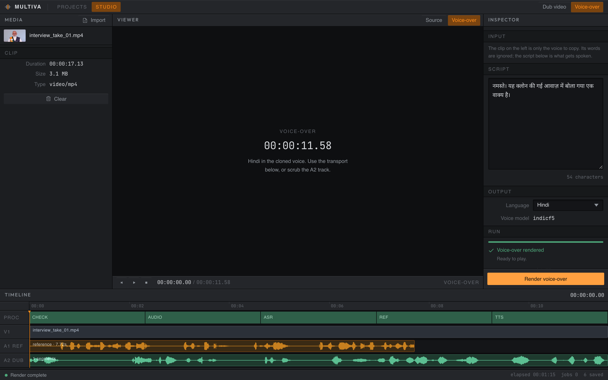

# Multiva

**Offline video dubbing for Indian languages that keeps the speaker's own voice
and re-syncs their lips.** A desktop application, an evaluation harness, and no
network dependency.

Point it at a talking-head video, pick a language, and get the same person
saying the same thing in that language, in their own voice, with their mouth
matching. Nothing is uploaded: no API key, no per-minute cost, no account.

```
video ─► faster-whisper ─► NLLB-200 ─► IndicF5 ─► Wav2Lip ─► dubbed video
          transcribe       translate    clone      re-sync
```



*The studio after a voice-over render. A1 is the reference the voice was cloned
from, A2 is the result; both waveforms are decoded from the actual audio.*

| | |
|---|---|
| **Languages** | Hindi, Marathi, Tamil, Telugu, Kannada, Gujarati, Malayalam, Punjabi, Odia, Assamese, Bengali (IndicF5) · English and others (XTTS) |
| **Runs on** | Apple silicon (MPS), CUDA, or CPU. Developed on an M4 / 24 GB |
| **Speed** | Roughly 12-15x realtime. An offline batch tool, not a live one |
| **Cloning** | Zero-shot from 6-12s of the speaker. No training, no fine-tuning |
| **Storage** | Local only. No database, no object store, no telemetry |

---

## Install

Python 3.10 and ffmpeg are the only prerequisites.

```bash
# macOS:  brew install python@3.10 ffmpeg
# Ubuntu: sudo apt install python3.10 python3.10-venv ffmpeg

git clone https://github.com/muditagrawal-alt/Multiva.Ai
cd Multiva.Ai

python3.10 -m venv venv
./venv/bin/pip install -r requirements.txt

# ~7.5 GB of weights: the five Hub models plus the two Wav2Lip checkpoints,
# which are too large for git. Resumable, and every file is checked against a
# SHA-256 before it is installed. --check reports without downloading.
./venv/bin/python scripts/download_models.py
```

Nothing else is required. There is no database to provision, no API key to
obtain, and no account to create - the pipeline, the models and your projects
are all local.

## Run it

**As a desktop app.** Starts the engine itself, shows what is loading, and opens
on your projects.

```bash
cd frontend && npm install && npm run build
cd src-tauri && cargo run          # cargo tauri build for an installer
```

**Or as a local service**, if you would rather use a browser. The interface is
a build artefact and is not in the repository, so build it once first.

```bash
cd frontend && npm install && npm run build && cd ..

cd Backend_pipeline
../venv/bin/python -m uvicorn app:app --port 8000
# then open http://127.0.0.1:8000/app/
```

**Check the whole thing works**, end to end, against a clip of your own:

```bash
./venv/bin/python scripts/selftest.py path/to/clip.mp4
```

A real dub, the phrase editor, re-rolling a take, choosing a different
reference window, a re-render, every export, a voice-over, and a cancellation
that actually stops. Anything needing a model you have not configured is
skipped rather than failed.

---

## What the studio does

A docked editor layout: media pool, viewer, inspector, timeline, status bar.
The timeline is not decorative - the waveforms are decoded from the real audio
and the ruler is scrubbable.

- **Dub a video** into any supported language, keeping the speaker's voice.
- **Voice-over from a script.** Type what you want said and have it read in the
  cloned voice. No translation, no timeline fitting, so every phrase is spoken
  at its natural pace.
- **Edit any phrase.** Select it on the timeline, change the words, re-speak
  just that line. One phrase re-synthesizes in seconds; the rest come from a
  per-phrase cache. Undo restores the previous take byte for byte, because
  regenerating would give a different one.
- **Re-roll a delivery.** Synthesis is seeded for reproducibility, so a new seed
  is how you get a different take of the same words.
- **Choose the reference window** the voice is cloned from, instead of accepting
  the automatic pick.
- **Trim** with in and out points, and lay a **music bed** under the result.
- **Export** SRT, VTT, the source transcript, or the translated script - built
  from timings the run already produced.
- **Cancel** a render. Cooperative, and it lands within about one phrase.
- **Projects persist.** Every dub is filed in a folder you choose and reopens
  with its phrase timeline intact.

## Script intelligence (optional)

One LLM call, for one job: rewriting a line **shorter so it fits its slot**.
When a translation runs longer than the speaker's original phrasing, the only
other option is time-stretching, and stretching is what makes a dub sound
robotic.

It defaults to Ollama on your own machine, and the studio's Script model panel
will offer whatever you have pulled. You can instead point it at Groq, Claude,
Gemini, OpenAI, Grok, or any OpenAI-compatible endpoint, in which case **one
line of already-translated text** leaves the machine per rewrite - never video,
audio, or the cloned voice.

```bash
ollama pull qwen2.5:7b            # the local default

cp .env.example .env              # or set a key for a hosted model
# GROQ_API_KEY=gsk_...
```

Measure any model against the job before trusting it:

```bash
./venv/bin/python scripts/fit_bench.py --provider ollama --model qwen2.5:7b
./venv/bin/python scripts/fit_bench.py --provider groq --model llama-3.3-70b-versatile
```

On four lines that overran their slots, `qwen2.5:7b` shortened three, but only
reached 78-83% of the original length on Hindi when asked for 70%, and returned
one line completely unchanged. English it handled well (60%). It preserved
every number. This is the measurement behind the "weak at Indic rewriting"
limit below, and the reason the panel exists at all.

It is not an agent. It proposes text into an editable box and cannot touch a
render; nothing reaches your video without you pressing Re-speak. Numbers in the
source line are enforced through a retry, because a dub that changes a date is
the one error a listener will never catch.

---
## Results

Measured across 21 clips (Hindi, English and mixed; 368p–1080p; portrait and
landscape) with `eval_harness.py`.

| | n | speaker similarity | dub CER | pace | A/V sync |
|---|---|---|---|---|---|
| same-language re-voice | 7 | **0.912** | **0.088** | 0.76 | 0 ms |
| cross-lingual dub | 14 | **0.878** | **0.158** | 0.99 | 0 ms |

*Speaker similarity is a WavLM x-vector cosine rescaled per clip between a floor
(the reference vs a different speaker) and a ceiling (the reference vs the
speaker's own audio). 1.0 means indistinguishable from the real speaker; 0.0
means a stranger. A raw cosine from this model sits near 0.9x for everything and
is meaningless unanchored.*

*CER re-transcribes the dub and compares it to the text the pipeline intended to
say — the closest automatable proxy for "can a listener follow this".*

---

---

## What was hard

**A model that produced perfect silence.** `AutoModel.from_pretrained` matched
**0 of 447** checkpoint tensors: IndicF5's weights are saved from a
`torch.compile`-wrapped module, so every key carries an `_orig_mod.` level the
instantiated model does not have. Both the DiT and the vocoder stayed randomly
initialised — in practice NaN — and the pipeline emitted digital silence of
exactly the right duration. Every duration and sync check passed. The only
signal was a warning buried in transformers' startup output.

That is why this repo has an evaluation harness. Every failure here had the same
shape: fine by the metric that existed, broken by the metric that did not.

- silence passed duration checks
- a 0.40× phase-vocoder squeeze (from a reference whose reported length did not
  match the file on disk) passed sync checks
- per-phrase compression ranging 0.85×–1.76× hid inside a healthy-looking 1.15×
  aggregate

**The evaluation was measuring noise.** Flow-matching sampling is stochastic, so
identical inputs produced audio differing by 0.81 max amplitude — and the same
clip scored CER 0.088 on one run and 0.258 on the next with nothing changed.
Synthesis is now seeded (bit-identical across runs), because an A/B harness that
cannot separate a code change from sampling luck is worse than no harness: it
produces confident, wrong conclusions.

**Speech rhythm is load-bearing.** Whisper segments are not speech units. Filling
each segment's slot with one continuous utterance replaced every pause inside it
with words. The audio has 2.41s of silence across 16 pauses of 50–150ms — short
enough to feel like nothing, and removing them makes speech unfollowable.
Whisper's own word timestamps cannot find them (it reported 1.1% pause against
the waveform's 11.9%), so they are detected from the audio envelope directly.

**Lip sync was ~50× too slow.** Face detection ran on CPU at full resolution,
every frame, and the output passed through five lossy encode generations.
Detecting on MPS at 256p every third frame with interpolation, and piping raw
frames into a single ffmpeg encode, took it from roughly 75× realtime to
**1.43×** with no loss in detection recall (32/32 frames at every setting tested).

---

---

## Evaluation

```bash
cd Backend_pipeline
../venv/bin/python eval_harness.py --all                     # score existing runs
../venv/bin/python eval_harness.py --build ../test_videos \
    --target hi --seconds 12 --no-lipsync --json after.json  # full sweep
```

Pointed at this project's own history, the harness flags the silent runs that
were once shipped as "verified" - `spk_norm` -1.08 to -1.65, `spd` 0.00 -
without being told which they were.

Every render also scores itself. The studio reports speaker similarity and A/V
drift per job, so a bad run is visible before you play it.

### A negative result worth publishing

`reference_audio.py` claims in its own comments that which window the voice is
cloned from "drives most of the cloning quality". That had never been tested, so
`scripts/reference_experiment.py` renders the same dub from each candidate
window and scores every variant against the same target - the speaker's own
audio, so no window can flatter itself.

On a 17s clip the spread across windows was **0.005**. The heuristic picked the
best one, and it barely mattered. Reference selection is not what limits quality
here, which rules out the obvious suspect and means the manual picker is a
convenience rather than a fix.

The same run surfaced something the metric misses: one window forced the
timeline to compress 1.288x where another needed only 1.110x. Compression is
what listeners hear as robotic, and speaker-similarity scoring is blind to it.
That, not the reference window, is where the next real gain is.

---

## Known limits

- **Roughly 12-15x realtime.** A 2-minute video takes about 25 minutes. TTS
  dominates, and batching does not help (measured) because the cost is DiT
  sampling itself.
- **IndicF5 articulates faster than some speakers.** On one clip it said the
  same words in 14.6s where the speaker took 17.6s. `fix_duration` sets total
  length; the model pads rather than slows when given more.
- **One voice per video.** Whisper does not diarize, so multi-speaker footage
  gets a single cloned voice. This is the largest capability gap.
- **Talking-head video only.** Wav2Lip needs a visible, roughly front-facing face.
- **Wav2Lip generates a 96x96 mouth**, composited back with a feathered mask.
  On 1080p footage this is the most visible weakness.
- **XTTS is under the Coqui Public Model License, which is non-commercial.**
  IndicF5 carries no such restriction.
- **The local LLM is weak at Indic rewriting.** Measured on real lines,
  `qwen2.5:7b` cut English 124 to 65 characters with meaning intact, and cut
  Hindi 0-13% when asked for 30%. Try `aya-expanse:8b`, or use a hosted key.
- **The desktop build is a shell, not a bundle.** `cargo tauri build` produces a
  ~4 MB installer that still expects the checkout and the venv beside it.
  Bundling Python and the weights is not done.
- Translation quality on poetry and heavy code-switching is weak; NLLB is a
  sentence-level model.

---

## Architecture

`Backend_pipeline/ARCHITECTURE.md` covers the stage-by-stage pipeline, which
models run where, how a finished dub is revised, and the traps that will
silently break this if disturbed - the checkpoint prefix, the coupling between
reported and actual reference duration, and the gradio / huggingface-hub pin.

## Contact

Built and maintained by one person. If something breaks, a language sounds
wrong, or you want another model supported, open an issue - that is the fastest
way to reach me.
